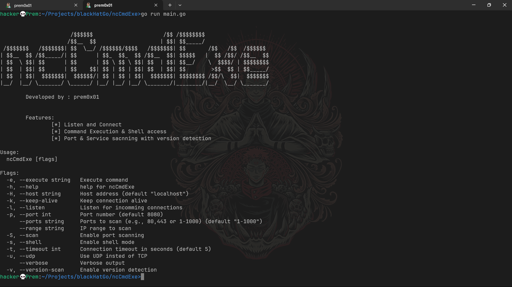

# ncCmdExe


---

### 🛠 NetCat with Command Execution!

A modern, powerful tool for network interaction and debugging, written in Go — packed with advanced features like command execution, port scanning, shell access, and more, all in a beautifully designed terminal UI.

---

## ✨ Features

- ✅ **Listen and Connect**
- 🖥️ **Command Execution**
- 🐚 **Interactive Shell Mode**
- 🔍 **Port Scanning with Version Detection**
- 💬 **Modern TUI interface using BubbleTea**
- 📡 **UDP / TCP Protocol Switching**
- 🔧 **Verbose & Keep-Alive Options**

---


## 📦 Installation

> **Pre-requisite**: Make sure [Go](https://golang.org/dl/) is installed on your system (Go 1.18+ recommended)

### 🔹 Option 1: Run directly (for development)

```bash
git clone https://github.com/prem0x01/ncCmdExe.git
cd ncCmdExe
go run main.go [flags/arguments]

