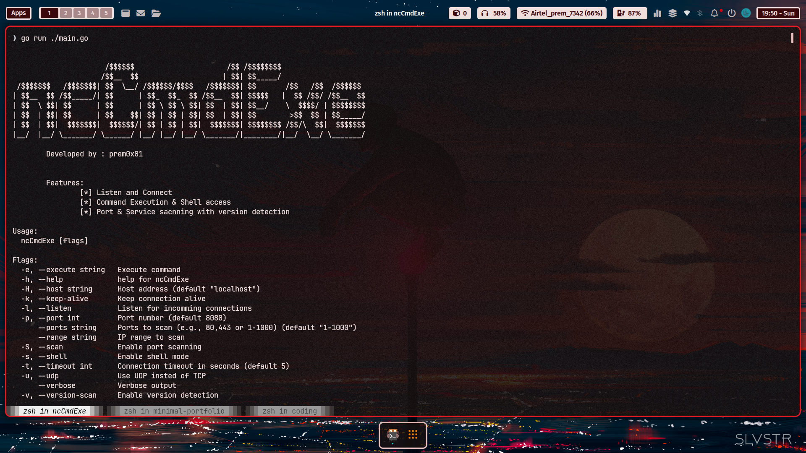

# ncCmdExe


---

### 🛠 NetCat with Command Execution!

A modern, powerful tool for network interaction and debugging, written in Go — packed with advanced features like command execution, port scanning, shell access, and more, all in a beautifully designed terminal UI.

---

## ✨ Features

-  **Listen and Connect**
-  **Command Execution**
-  **Interactive Shell Mode**
-  **Port Scanning with Version Detection**
-  **Modern TUI interface using BubbleTea**
-  **UDP / TCP Protocol Switching**
-  **Verbose & Keep-Alive Options**

---



## 📦 Installation

> **Pre-requisite**: Make sure [Go](https://golang.org/dl/) is installed on your system (Go 1.18+ recommended)

### 🔹 Option 1: Run directly (for development)

```bash
git clone https://github.com/prem0x01/ncCmdExe.git
cd ncCmdExe
go run main.go [flags/arguments]
```

### 🔹 Option 2: Build a binary

```bash
go build -o ncCmdExe .
./ncCmdExe [flags/arguments]
```

---

## 🚀 Usage examples

Every example below uses two terminals: one for the listener (`-l`), one for the connecting client. Swap `127.0.0.1` for a real host/IP when testing across machines.

### Plain relay (classic netcat)

```bash
# terminal 1 — listen
./ncCmdExe -l -p 4444

# terminal 2 — connect
./ncCmdExe 127.0.0.1 -p 4444
```
Anything typed on one side is streamed to the other. Good for quick data transfer or debugging raw TCP.

### Interactive exec REPL (`--exec-mode`)

Run commands remotely with output streamed back, `cd` support, and file transfer built in — but no PTY, so avoid programs that talk directly to a terminal (`sudo`, `vim`, `ssh` password prompts).

```bash
# terminal 1 — server
./ncCmdExe -l -p 4444 --exec-mode

# terminal 2 — client
./ncCmdExe 127.0.0.1 -p 4444 --exec-mode
```
```
~ $ ls
~ $ !upload ./notes.txt      # send a file to the server
~ $ !download report.csv     # pull a file from the server
~ $ exit
```

### Full remote shell with PTY (`--tty`)

A real interactive shell over the wire — arrow keys, tab-completion, `sudo` password prompts, and your shell's own prompt/theme all work correctly.

```bash
# terminal 1 — server
./ncCmdExe -l -p 4444 --tty

# terminal 2 — client
./ncCmdExe 127.0.0.1 -p 4444 --tty
```
Press `Ctrl+]` to detach without closing the server.

### PTY bind shell (`-s`)

Same PTY experience as `--tty`, but launched from the listener side (`-l -s`) instead of a dedicated shell-handshake mode:

```bash
./ncCmdExe -l -p 4444 -s
```

### Classic `-e` (run one fixed command on connect)

```bash
./ncCmdExe -l -p 4444 -e "whoami"
```

### Port scanning

```bash
./ncCmdExe -S 192.168.1.1 --ports 1-1024 -v
```

### Screen streaming

```bash
# terminal 1 — server (captures + sends the screen)
./ncCmdExe -l -p 4444 --stream

# terminal 2 — client (opens a browser viewer)
./ncCmdExe 127.0.0.1 -p 4444 --stream
```

### No flags — TUI menu

```bash
./ncCmdExe
```
Walks you through connect/listen/scan/shell options interactively.

---

## 🐳 Testing with Docker

You don't need a second physical machine to test `ncCmdExe` — two containers on a Docker bridge network behave like two real hosts on a LAN, with proper IP-to-IP routing, and are disposable if you're testing risky modes (`--exec-mode`, `--tty`, `-e`).

**1. Build a test image:**

```dockerfile
# Dockerfile.nctest
FROM golang:1.25-bookworm AS build
WORKDIR /src
COPY . .
RUN go build -o /ncCmdExe .

FROM debian:bookworm-slim
RUN apt-get update && apt-get install -y --no-install-recommends \
    sudo procps iproute2 iputils-ping vim less \
    && rm -rf /var/lib/apt/lists/*
RUN useradd -m -s /bin/bash tester && echo "tester ALL=(ALL) PASSWD:ALL" >> /etc/sudoers \
    && echo "tester:tester" | chpasswd
COPY --from=build /ncCmdExe /usr/local/bin/ncCmdExe
USER tester
WORKDIR /home/tester
ENTRYPOINT ["sleep", "infinity"]
```

```bash
docker build -f Dockerfile.nctest -t nccmdexe-test .
```

**2. Create a bridge network and start two containers on it:**

```bash
docker network create nctest
docker run -d --rm --network nctest --name nc-server nccmdexe-test
docker run -d --rm --network nctest --name nc-client nccmdexe-test

# find the server's IP
docker network inspect nctest -f '{{range .Containers}}{{.Name}} -> {{.IPv4Address}}{{"\n"}}{{end}}'
```

**3. Start the listener inside `nc-server`, then connect from `nc-client`:**

```bash
docker exec -d nc-server ncCmdExe -l -p 4444 --exec-mode
docker exec -it nc-client ncCmdExe 172.23.0.2 -p 4444 --exec-mode   # use the IP printed above
```

**4. Clean up:**

```bash
docker rm -f nc-server nc-client
docker network rm nctest
```

### Why the containers need to be on the same network

`ncCmdExe` just opens a TCP socket — it needs a routable path from client to server, nothing more. Containers on the same Docker bridge network get directly routable IPs, so this "just works." Put them on two separate isolated networks (or two different physical LANs / a home network vs. the internet) and a plain connection will time out — there's no route, the same way it would fail for `nc`, `ssh`, or any other raw TCP tool.

To reach a listener across network boundaries for real, you need one of:
- **Port forwarding** on the server side's router/firewall (`-p hostPort:containerPort` in Docker, or a router NAT rule for a home network)
- **A public listener**, e.g. a cloud VM with a real public IP
- **A tunnel**, e.g. `ngrok`, Tailscale/WireGuard, or an SSH reverse tunnel

Example of bridging two isolated Docker networks via a host port-forward:

```bash
docker network create nctest2
docker run -d --rm --network nctest -p 14444:4444 --name nc-server nccmdexe-test
docker run -d --rm --network nctest2 --name nc-client nccmdexe-test

docker exec -d nc-server ncCmdExe -l -p 4444 --exec-mode

# nc-client is on a different network — reach the server via the host gateway + published port
HOST_IP=$(docker network inspect nctest2 -f '{{(index .IPAM.Config 0).Gateway}}')
docker exec -it nc-client ncCmdExe $HOST_IP -p 14444 --exec-mode
```

> ⚠️ Because `--exec-mode`/`--tty`/`-e` give the connecting side command execution, only expose a listener beyond your local machine/network intentionally, and never to the open internet without authentication in front of it.

